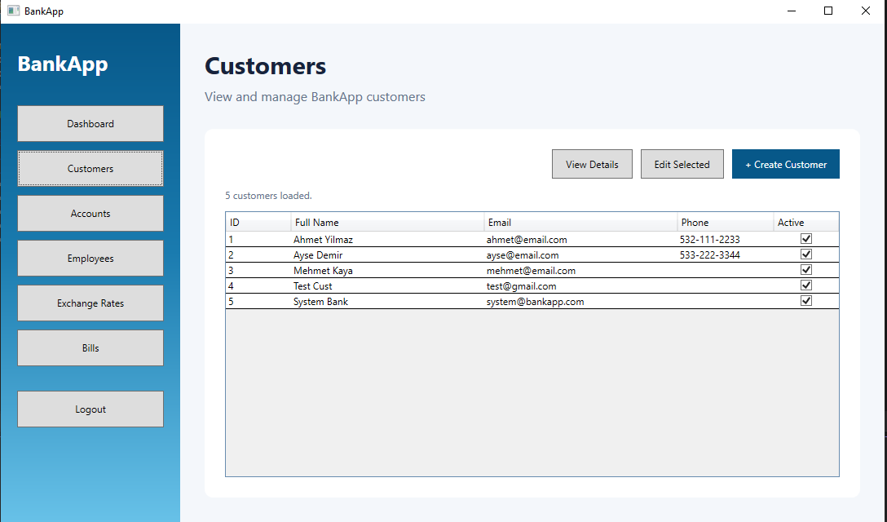

# BankApp

A full-stack banking application developed as an internship project. BankApp combines a React web portal and a WPF desktop client with an ASP.NET Core API and SQL Server database.

## Screenshots

### Web application

| Money transfer | Customer loans |
| --- | --- |
|  |  |

| Loan approval | AI assistant |
| --- | --- |
|  |  |

### WPF desktop client



## Features

- **Account transfers** — direct same-currency transfers up to 5,000 TRY and an approval workflow for larger transfers
- **Foreign exchange** — exchange between supported currencies through TRY using live rates
- **Bill payments** — automatic account matching by currency and balance, with manual account selection available
- **Loan management** — applications, approval, amortization schedules, monthly auto-debit, early closure, and default tracking
- **AI banking assistant** — Groq Llama 3.3 function calling for account, loan, exchange-rate, and EMI questions
- **Live exchange rates** — a background service retrieves Frankfurter API rates and publishes updates through SignalR
- **Real-time notifications** — SignalR notifications for administrative approvals and customer updates
- **Administrative tools** — customer, account, employee, bill, exchange-rate, transaction, and loan management
- **WPF desktop client** — authenticated administrative CRUD operations using the same backend API
- **Audit and data safety** — stored-procedure transactions, approval holds, history tables, triggers, and soft-delete behavior

## Technology stack

| Layer | Technologies |
| --- | --- |
| Backend | ASP.NET Core 10, C#, JWT authentication, SignalR |
| Web client | React 19, TypeScript, Vite |
| Desktop client | WPF, C#, .NET 10 |
| Data access | Microsoft.Data.SqlClient, raw SQL, stored procedures |
| Database | SQL Server |
| External services | Groq API, Frankfurter API |

## Architecture

```text
React web client ─┐
                  ├── ASP.NET Core API ── Services ── Stored procedures ── SQL Server
WPF desktop client┘          │
                             ├── SignalR real-time updates
                             ├── Groq AI assistant
                             └── Frankfurter exchange rates
```

## Project structure

```text
BankApp/
├── Controllers/          # HTTP API endpoints
├── BankApp.Services/     # Business logic
├── BankApp.DataAccess/   # SQL Server and stored-procedure access
├── BankApp.Entity/       # Domain entities
├── BankApp.Common/       # DTOs, interfaces, results, and helpers
├── Client/               # React web application
├── BankAppWPF/           # WPF desktop application
├── migration.sql         # Database schema, procedures, and triggers
└── seed.sql              # Development sample data
```

## Prerequisites

- [.NET 10 SDK](https://dotnet.microsoft.com/download)
- [Node.js](https://nodejs.org/) and npm
- SQL Server with Windows Authentication
- A Groq API key for the AI assistant

## Local setup

1. Clone the repository and enter the project directory:

   ```bash
   git clone <repository-url>
   cd BankApp
   ```

2. Run `migration.sql` against SQL Server to create the database, tables, stored procedures, and triggers.

3. Run `seed.sql` to add development sample data.

4. Create an `appsettings.Development.json` file in the project root and add your Groq configuration:

   ```json
   {
     "Groq": {
       "ApiKey": "YOUR_GROQ_API_KEY",
       "Model": "llama-3.3-70b-versatile"
     }
   }
   ```

   `appsettings.Development.json` is ignored by Git. Do not commit API keys or other secrets.

5. Start the backend API from the project root:

   ```bash
   dotnet run
   ```

   The API runs at `http://localhost:5000`.

6. In a second terminal, install and start the React client:

   ```bash
   cd Client
   npm install
   npm run dev
   ```

   The web application runs at `http://localhost:5173`.

7. To use the desktop client, keep the API running and launch the WPF project:

   ```bash
   dotnet run --project BankAppWPF/BankAppWPF.csproj
   ```

## Notes

- The application is intended for local development and demonstration.
- The React and WPF clients share the same ASP.NET Core backend.
- Financial operations are implemented through SQL Server stored procedures with explicit transaction handling.
