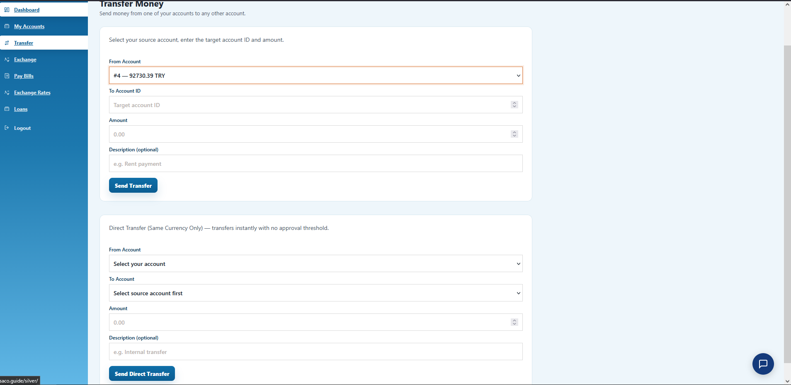
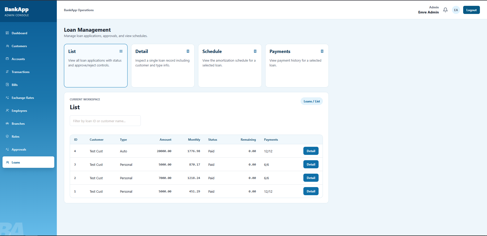
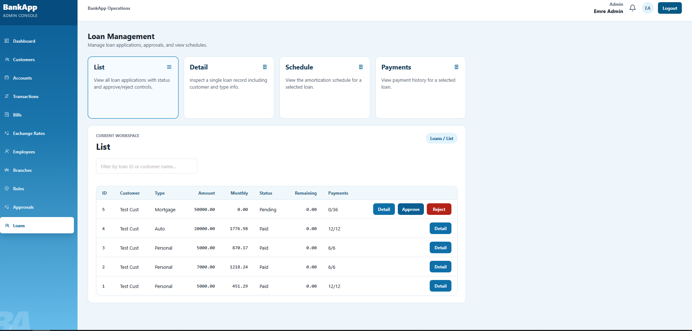
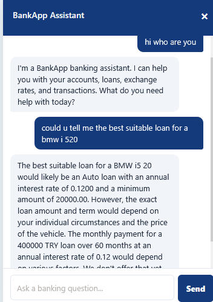

# BankApp

Full-stack banking application built during internship at VakifBank.

## Stack

**Backend:** ASP.NET Core 10, raw SQL via stored procedures, JWT auth, SignalR
**Frontend:** React 19 + TypeScript, Vite
**Database:** SQL Server (Windows Auth), all IDs IDENTITY(1,1)

## Features

- **Transfers** — same-currency direct (≤5,000 TRY) or approval-based (>5,000 TRY) with admin workflow
- **Forex exchange** — any currency pair via TRY intermediary with live rates
- **Bill payment** — auto-matching account by currency + balance, or manual selection
- **Loan module** — apply, amortization schedule, monthly auto-debit, early close (2% penalty), default tracking
- **AI chatbot** — Groq Llama 3.3 with function calling: answers about accounts, loans, rates, EMI calculations
- **Live FX rates** — BackgroundService polls Frankfurter API, pushes via SignalR WebSocket
- **Real-time notifications** — SignalR toasts + bell for admin approvals
- **Soft-delete cascading** — deactivating a customer deactivates all their accounts
- **Admin portal** — searchable dropdowns, FK name resolution, loan approval/schedule views
- **WPF desktop client** — admin CRUD operations

## Setup

1. Run `migration.sql` on SQL Server (creates database, tables, SPs, triggers)
2. Run `seed.sql` for test data
3. Set Groq API key in `appsettings.Development.json`
4. Backend: `dotnet run` (port 5000)
5. Frontend: `cd Client && npm install && npm run dev` (port 5173)
